# Stark Brokers Platform

Laravel 11 real-estate marketplace with React SPA (public/renter/owner) and Blade admin dashboard.

## Overview

`StarkBrokers` is a bilingual (Arabic/English) property platform that connects renters and owners.
The app uses a service-oriented Laravel backend, Sanctum auth, OTP verification, and a React frontend.

### Key Highlights

- React SPA for public browsing, renter, and owner flows
- Blade admin dashboard for moderation and settings
- Versioned API under `routes/api/v1.php`
- OTP login/register with Twilio Verify
- Property filtering, favorites, booking requests, and status workflow
- Google Maps integration and dynamic app settings

## Features

### Public & Search

- Homepage with featured properties
- Available properties listing with filters
- Property details and map view
- FAQ and contact-us pages

### Authentication & Users

- OTP register/login for renter and owner
- Saudi/Egypt phone validation (`+966`, `+20`)
- Sanctum token-based authenticated routes

### Renter & Owner

- Renter: profile, favorites, bookings/tours
- Owner: profile, property CRUD, request management

### Admin

- User moderation, categories, features, FAQs
- Unit moderation and booking oversight
- Runtime settings management

## Architecture

```text
React SPA / Blade Admin
        |
        v
 Laravel Routes (web.php + api/v1.php)
        |
        v
Controllers -> Services -> Models -> MySQL
        |
        v
   HttpResponse JSON envelope
```

### Core Paths

| Area | Main Files |
|---|---|
| API Routes | `routes/api/v1.php` |
| Web/Admin Routes | `routes/web.php` |
| API Controllers | `app/Http/Controllers/Api/*` |
| Services | `app/Services/Api/*`, `app/Services/Admin/*` |
| React App | `resources/js/AppContent.jsx` |
| Axios Client | `resources/js/services/axiosInstance.js` |

### ERD

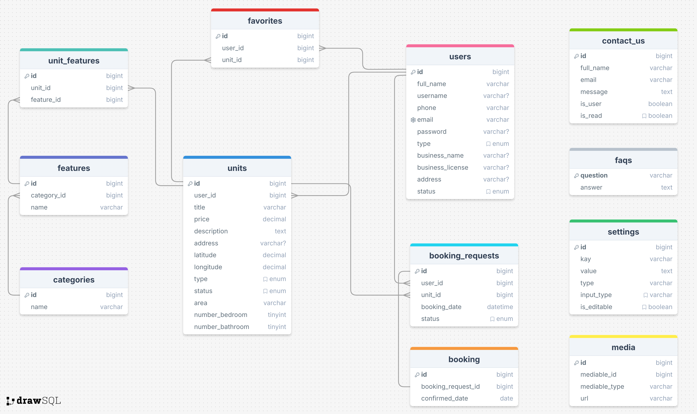

## Screenshots

### Desktop Highlights

| Home (Desktop) | Dashboard (Desktop) |
|---|---|
| 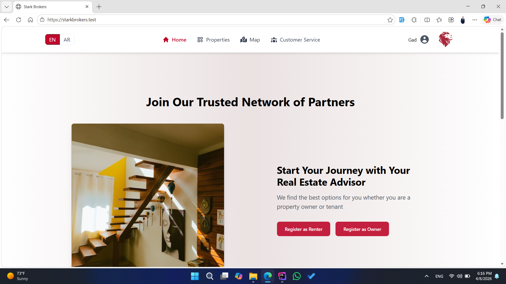 | 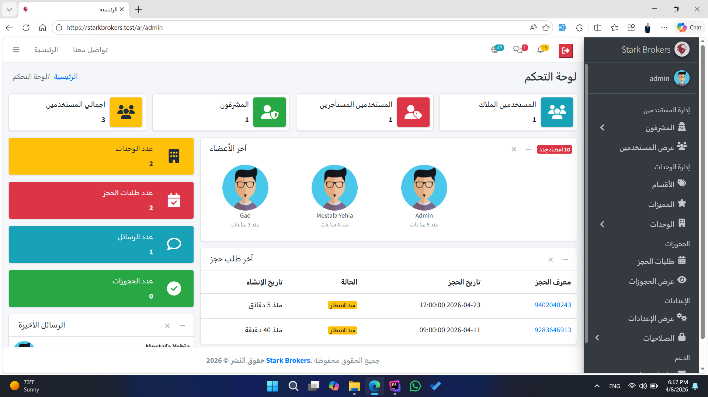 |

### Auth Flow

| Login | Register | Verify OTP |
|---|---|---|
| 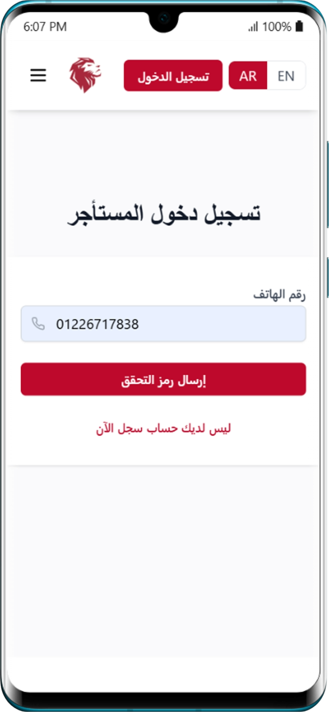 | 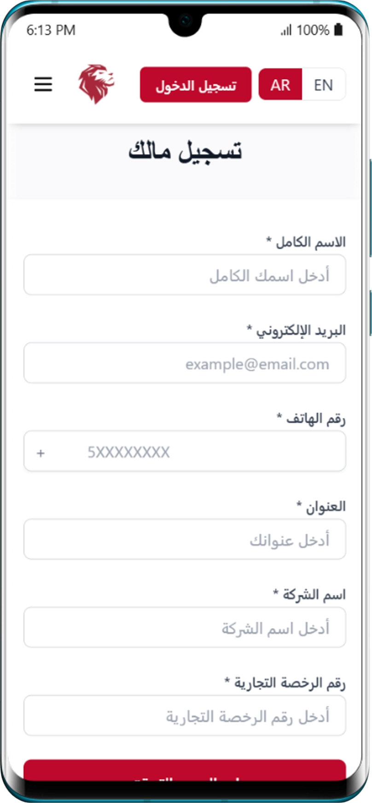 | 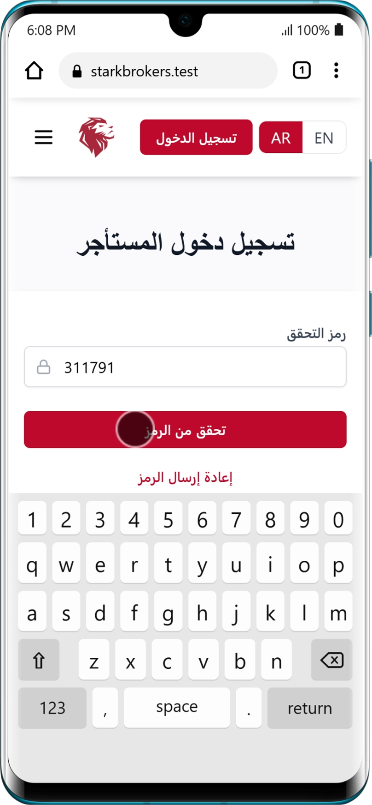 |

### Public UI

| Home Variant 1 | Home Variant 2 | Home Variant 3 |
|---|---|---|
| 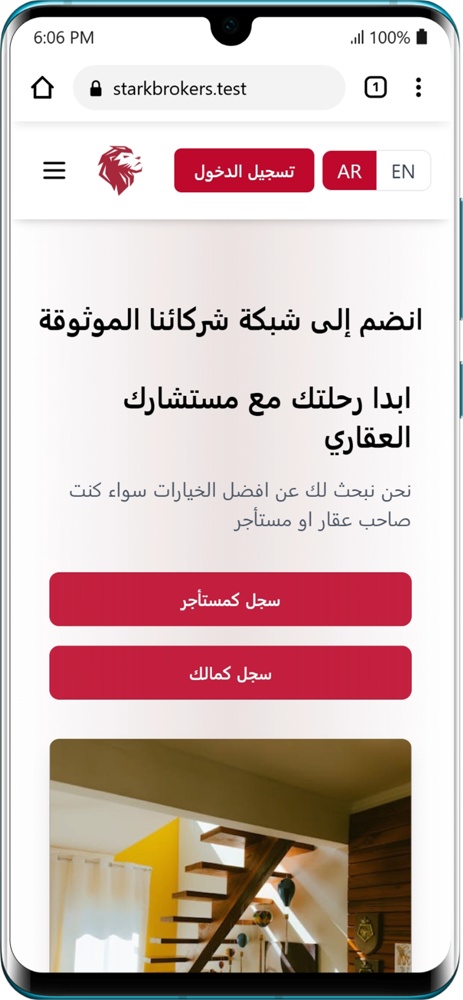 | 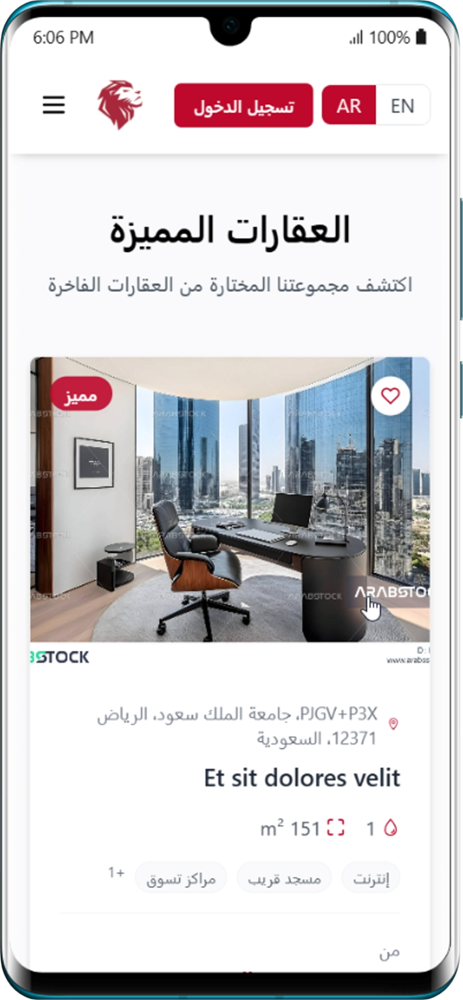 | 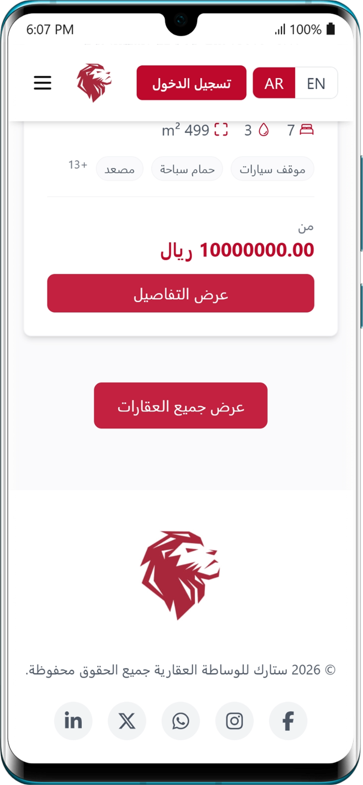 |

| Property Details | Map |
|---|---|
| 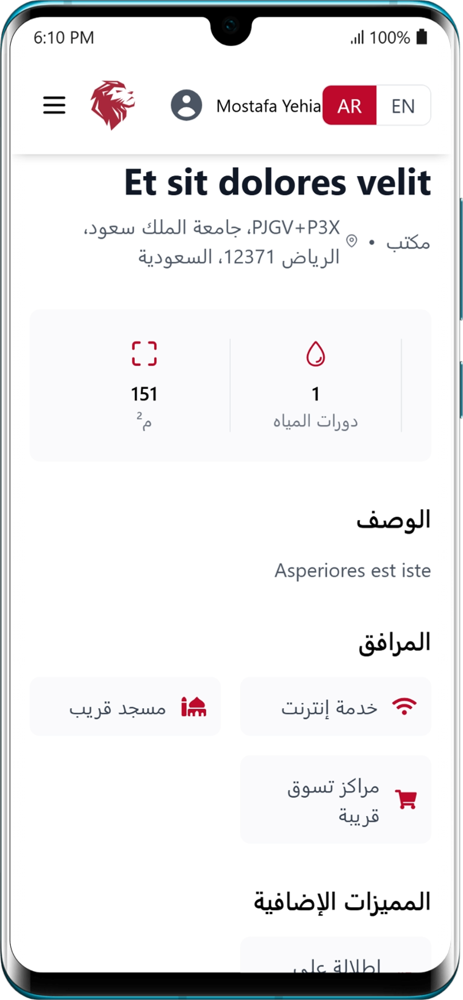 | 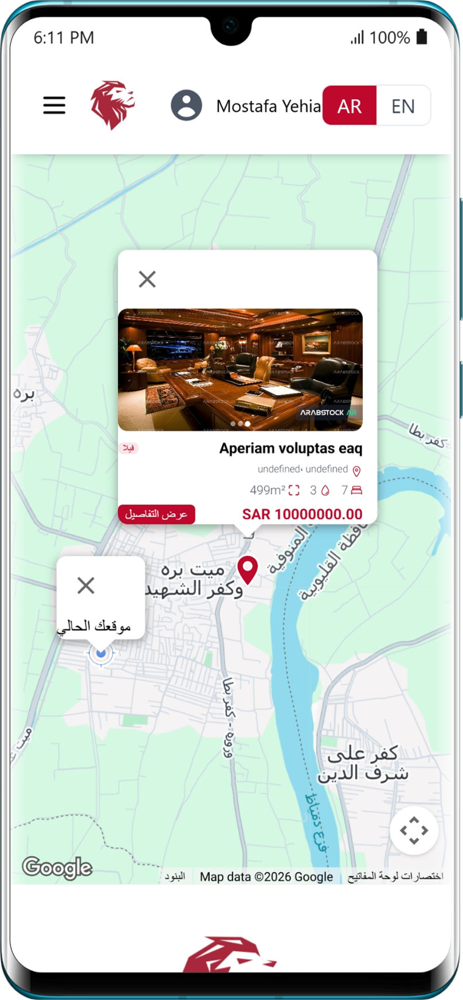 |

### User Areas

| Favorites | Profile | Tours |
|---|---|---|
| 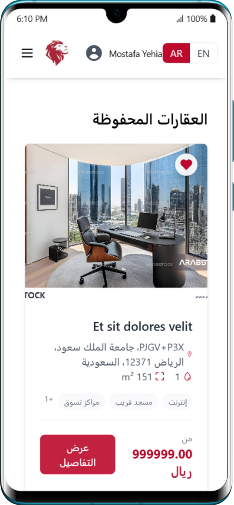 | 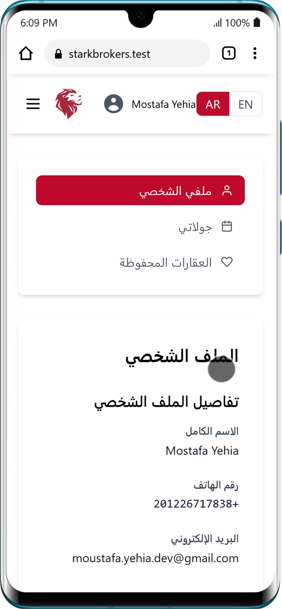 | 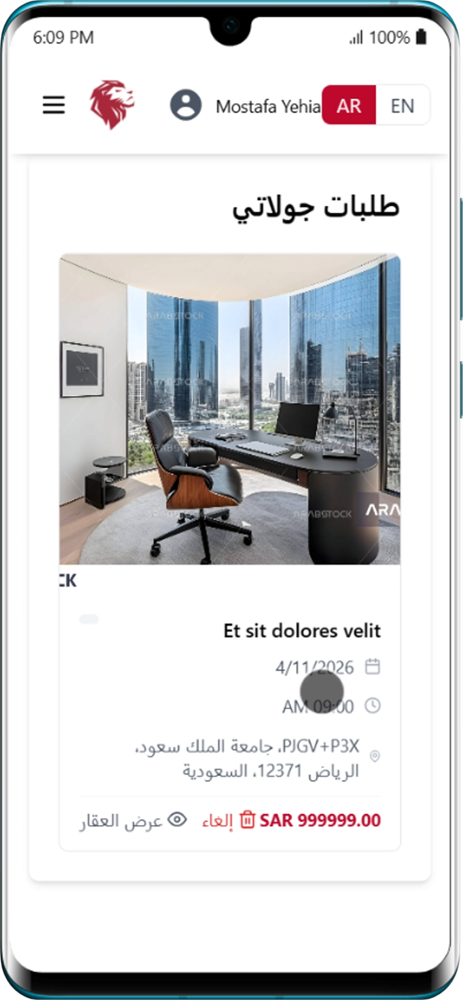 |

### Admin / Operations

| Booking | Contact Us |
|---|---|
| 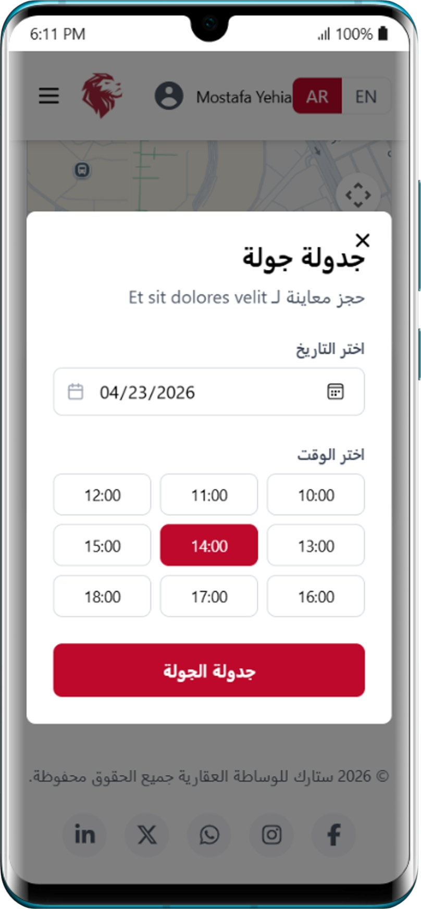 | 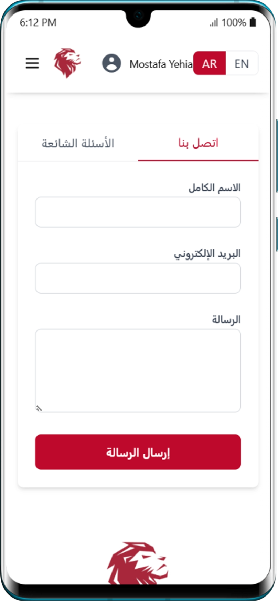 |

| FAQ | Add Unit Step 1 | Add Unit Step 2 |
|---|---|---|
| 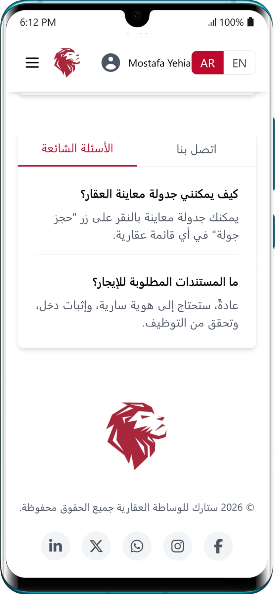 |  |  |


## Installation

### Prerequisites

- PHP `^8.2`
- Composer `^2`
- Node.js `>=18`
- npm `>=9`
- MySQL/MariaDB

### Setup

```bash
composer install
npm install
copy .env.example .env
php artisan key:generate
php artisan migrate --seed
composer dev
```

### If You Use Split Terminals

```bash
php artisan serve
npm run dev
```

## Usage

### Common Commands

```bash
php artisan test
./vendor/bin/pint
npm run build
```

### API Base URL (Local Example)

- `http://127.0.0.1:8000/api/v1`

### Quick Endpoints

- `GET /setting`
- `POST /auth/login`
- `POST /auth/register`
- `POST /auth/verify-otp`
- `GET /units`
- `GET /units/details/{id}`

Postman collection: `Postman Collection/Stark Brokers.postman_collection.json`

Postman API docs: [https://documenter.getpostman.com/view/29185004/2sAYHwHPqT](https://documenter.getpostman.com/view/29185004/2sAYHwHPqT)

## Technologies

### Backend

- Laravel 11, PHP 8.2+, Sanctum, Spatie Permission
- Twilio SDK, Mcamara Localization

### Frontend

- React 18, React Router 6, Axios, Vite 5
- Tailwind CSS, React Hot Toast, React Icons
- `@react-google-maps/api`

## License

Project metadata declares `MIT` license in `composer.json`.

## 📞 Support & Questions

For issues, feature requests, or questions:

- **GitHub Issues**: [Open an Issue](https://github.com/mostafayehia2002/starkbrokers/issues)
- **Email**: moustafa.yehia.dev@gmail.com
---

## 🤝 Project Information

- **Repository**:`https://github.com/mostafayehia2002/stark-brokers`
- **Author**: Mostafa Yehia
- **Maintained**: Actively developed and maintained

---

**Made with ❤️ using Laravel 12 • [Star on GitHub ⭐](https://github.com/mostafayehia2002/stark-brokers)**


